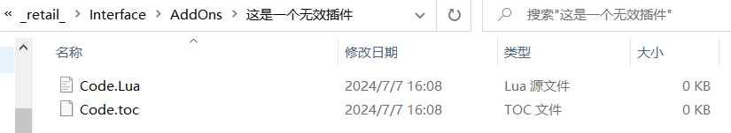
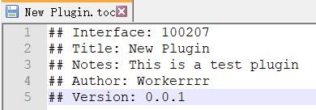

*更新日期: 2024-7-7*

## 前言

这是一个《魔兽世界》游戏插件开发笔记本
这是一个用于学习的测试项目，不保证插件能够正常使用

# 魔兽世界插件开发

### 魔兽世界插件结构

在游戏《魔兽世界》中，每一个插件都以文件夹的形式存放在一个名为`AddOns`文件夹内
> 

`AddOns`文件夹的路径是`游戏根目录` -> `_retail` -> `Interface`

游戏将会查找`AddOns`文件夹下每个插件文件夹内的与该文件夹同名的后缀微`toc`的文件，并将其视为一个插件
即使该`toc`文件并没有任何数据，只要文件名与文件夹名相同，游戏仍视为一个插件
> 
  
  
  
  *这样一个插件就完成啦！(误)*

### 编辑TOC文件

上面我们得知，魔兽世界实际上是依靠`toc`文件来判断插件，因为`toc`文件用于储存插件的名称、版本、加载列表等信息
我们想要制作一个插件，第一步就是编辑好一个`toc`文件
* 新建一个文件夹，并新建`toc`文件
> 

**编辑插件基本信息**
使用文本编辑器即可打开`toc`文件，但在此之前，我们先来学习一下`toc`文件中可以编辑哪些属性
`Interface`：可以简单地将其理解为游戏版本代码，如果该项与当前的游戏版本不匹配，游戏则会提示“插件过期”
`Title`：插件的标题
`Notes`：插件的描述
`Author`: 插件的作者
`Version`: 插件的版本号
`Dependencies`: 依赖关系，如果没有开启与此项对应的插件，游戏则会提示“依赖功能缺失”
> 
  

**引用Lua文件**
如果想让插件调用一个Lua文件，可以直接在`toc`中添加该文件的相对路径和文件名
> 
  

### 编写程序

魔兽世界插件使用`Lua`编写，网络上有许多Lua的详细教程
在开始编程之前，我先推荐两个有很大帮助的插件：BugGrabber 和 BugSack，这两个插件必须搭配使用，它会自动检测游戏内的所有插件是否存在问题，并提供了一键重新加载功能，极大地方便我们调试插件
* 新建一个`Lua`文件
> 

* 编写一个简单程序
> 

* 重新加载游戏，聊天框成功打印字符，插件成功报错
> 
  

